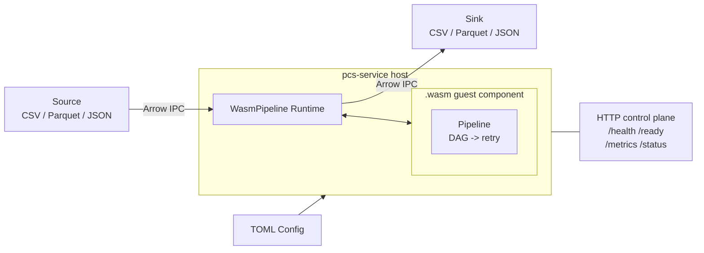

<div align="center">
  
  <h1>PCS — Distributed Batch Processing for Rust, on Apache Arrow</h1>

[](https://nassor.github.io/pcs/)
[](https://github.com/nassor/pcs/blob/main/LICENSE)
[](https://github.com/nassor/pcs/actions)
[](https://www.rust-lang.org)

<em>**Service-first batch processing engine. Write pipelines in Rust, ship them as WebAssembly components, run them on `pcs-service`.**</em>
</div>

# Overview

**PCS** (Pipeline Component System) is a distributed batch processing engine for Rust built on Apache Arrow. You write typed `System` impls that declare which Arrow fields they read and write; PCS derives the execution order, runs independent stages in parallel, handles retry with exponential backoff, and distributes work across nodes with at-least-once semantics backed by Raft consensus.

PCS is **service-first**: the `pcs-service` binary is the deployment target. Pipeline authors write Rust code against the `pcs-guest` SDK, compile it to a WebAssembly component (`wasm32-wasip2`), and hand the `.wasm` file to `pcs-service` via TOML config. The service loads the component, validates it, and drives execution — standalone or clustered.

The naming is a nod to ECS (Entity Component System) from game development. Where ECS organizes game entities as reusable components that systems act on each frame, PCS organizes a data `Pipeline` as reusable `Component`s that `System`s transform in field-granular DAG order.

### Disclaimer

This is so far a playground project to explore two things: 

- How to use Claude Code Agents as Skills (hyper-specialized Agents) to maintain a non-trivial Rust codebase with multiple crates, a binary, and a WebAssembly component. The goal is to see how far we can get with minimal human intervention in code maintenance and review.

- The design space of a Rust-native batch engine with WebAssembly extensibility. It's not yet production-ready, but contributions and feedback are very welcome!

## Key capabilities

- **Field-granular DAG scheduling** — systems declare `reads` and `writes` per Arrow field; the pipeline builds a dependency graph and runs independent systems in the same stage. Two systems writing different fields of the same component run concurrently.
- **WebAssembly Component Model** — pipelines compile to `wasm32-wasip2` components via `cargo-component`. The host loads them at runtime with zero recompilation of the service.
- **Zero-copy Arrow IPC** — checkpoint writes and host↔guest data transfer use Arrow IPC. 11.1x faster decode than postcard at 1M rows.
- **Distributed execution with Raft consensus** — partition assignment and checkpointing across nodes using an embedded Raft state machine over redb.
- **Composable `System` trait** — each transform is an independent, testable Rust struct with explicit field-level read/write declarations.
- **Configurable retry** — per-system `ExponentialBackoff` with max retries, base delay, multiplier, cap, and jitter.
- **3-gate load-time validation** — structural WASM validation, WIT world match, and semantic schema-fingerprint check before any data flows.

# Quick start

## Prerequisites

```bash
rustup target add wasm32-wasip2
cargo install cargo-component --locked --version 0.21.1
cargo install wasm-tools --locked --version 1.246.2
```

## 1. Create a guest pipeline

```bash
cargo component new --lib my-pipeline
cd my-pipeline
```

Set up `Cargo.toml`:

```toml
[package]
name = "my-pipeline"
edition = "2024"

[lib]
crate-type = ["cdylib"]

[dependencies]
pcs-guest = { path = "../path/to/pcs/crates/pcs-guest" }
serde = { version = "1", features = ["derive"] }

[package.metadata.component]
package = "example:my-pipeline"

[package.metadata.component.target]
path = "../path/to/pcs/crates/pcs-guest/wit"
world = "pcs-pipeline"
```

## 2. Define components and systems

Write `src/lib.rs`:

```rust
use pcs_guest::prelude::*;
use pcs_guest::arrow_schema::{DataType, Field, Schema};
use std::sync::Arc;

// Components are Arrow-serializable structs
#[derive(serde::Serialize, serde::Deserialize)]
struct Order {
    id: u64,
    amount: f64,
    tax: f64,
}

impl Component for Order {
    fn name() -> &'static str { "Order" }
    fn schema() -> Arc<Schema> {
        Arc::new(Schema::new(vec![
            Field::new("id",     DataType::UInt64,  false),
            Field::new("amount", DataType::Float64, false),
            Field::new("tax",    DataType::Float64, false),
        ]))
    }
}

impl Order {
    const AMOUNT: FieldRef<Order> = FieldRef::new("amount");
    const TAX:    FieldRef<Order> = FieldRef::new("tax");
}

// Systems declare field-level reads/writes for automatic DAG scheduling
struct TaxSystem;

#[async_trait::async_trait]
impl System for TaxSystem {
    fn meta(&self) -> SystemMeta {
        SystemMeta::new("tax")
            .reads(Order::AMOUNT)
            .writes(Order::TAX)
    }
    async fn run(&self, data: &mut Dataset) -> PcsResult<()> {
        let orders = data.view::<Order>()?;
        let amounts = orders.f64(Order::AMOUNT)?;
        let taxes: Vec<f64> = (0..orders.len())
            .map(|i| amounts.value(i) * 0.1)
            .collect();
        // ... write taxes back via data.replace_batch
        Ok(())
    }
}

// Pipeline construction — called once by the macro on first use
fn build() -> Pipeline {
    Pipeline::builder("order-tax")
        .with::<Order>()
        .with_system(TaxSystem)
        .build()
}

// Wire the pipeline to the WIT exports
#[cfg(target_arch = "wasm32")]
#[allow(warnings)]
mod bindings;

#[cfg(target_arch = "wasm32")]
pcs_guest::export_pipeline!(build);
```

## 3. Build the WASM component

```bash
cargo component build --release --target wasm32-wasip2
```

Output: `target/wasm32-wasip1/release/my_pipeline.wasm`

Validate:

```bash
wasm-tools validate --features component-model target/wasm32-wasip1/release/my_pipeline.wasm
```

## 4. Configure and run the service

Create sample input data in `orders.csv`:

```csv
id,amount,tax
1,100.00,0.0
2,249.99,0.0
3,50.00,0.0
```

Create `config.toml`:

```toml
mode = "standalone"

[node]
id = 1
data_dir = "/var/lib/pcs/node-1"

[run_mode]
kind = "one_shot"

[pipeline.wasm]
module = "./my_pipeline.wasm"
watch = false

[pipeline.wasm.config]
tax_rate = "0.1"

[[sources]]
name = "orders_in"
type = "CsvSource"
target_component = "Order"

[sources.config]
path = "./orders.csv"
has_headers = true

[[sources.config.schema_fields]]
name = "id"
type = "UInt64"
nullable = false

[[sources.config.schema_fields]]
name = "amount"
type = "Float64"
nullable = false

[[sources.config.schema_fields]]
name = "tax"
type = "Float64"
nullable = false

[[sinks]]
name = "orders_out"
type = "CsvSink"
source_component = "Order"

[sinks.config]
path = "./orders_out.csv"
has_headers = true

[[sinks.config.schema_fields]]
name = "id"
type = "UInt64"
nullable = false

[[sinks.config.schema_fields]]
name = "amount"
type = "Float64"
nullable = false

[[sinks.config.schema_fields]]
name = "tax"
type = "Float64"
nullable = false

[http]
bind = "0.0.0.0:8080"
```

Run:

```bash
pcs-service serve --config config.toml
```

The service loads the `.wasm` component, calls `describe()` to validate schemas, reads `orders.csv` via the configured source, and passes the data as Arrow IPC to the guest's `run-batch`. The `TaxSystem` computes `tax = amount × 0.1`, and the result is written to `orders_out.csv`:

```csv
id,amount,tax
1,100.00,10.00
2,249.99,25.00
3,50.00,5.00
```

## 5. Validate before deploying

```bash
pcs-service validate ./my_pipeline.wasm --config config.toml
```

Three validation gates run in order: structural WASM parse, WIT world match, and semantic schema-fingerprint check against any existing checkpoints.

# Architecture

## How it works



1. **Host** (`pcs-service`) loads the `.wasm` component and validates it against the TOML config.
2. **Sources** (Parquet, CSV, JSON) feed Arrow `RecordBatch`es into the host.
3. Host serializes each batch to Arrow IPC and calls the guest's `run-batch` export.
4. **Guest** deserializes the IPC, runs the full system DAG (field-granular parallelism, retry), and returns the result as IPC.
5. Host writes output to **Sinks** and persists checkpoints.

The guest owns the entire DAG scheduler, retry logic, and system execution. The host owns IO, distribution, checkpointing, and the HTTP control plane.

## Workspace layout

```
crates/
├── pcs-core/        # Dataset, Pipeline, System, Scheduler, Component
│                    # Arrow-only deps. Used by both host and guest.
├── pcs-guest/       # Guest SDK: re-exports pcs-core + export_pipeline! macro
│                    # Owns the canonical WIT at wit/pipeline.wit
├── pcs-guest-smoketest/  # Minimal guest for CI validation
└── pcs-service/     # Host binary: wasmtime, IO, distributed, config, HTTP
```

## WIT interface (`pcs:pipeline@0.1.0`)

The guest exports five functions:

| Export | Purpose |
|--------|---------|
| `describe()` | Returns pipeline metadata (name, version, component schemas, fingerprint). Called once at load time. |
| `init(config)` | Receives the TOML config block as JSON. Called once before first batch. |
| `run-batch(ipc, prior)` | The hot path. Receives Arrow IPC input + optional checkpoint, returns IPC output + metrics. |
| `snapshot()` | Emit a point-in-time checkpoint between batches. |
| `restore(checkpoint)` | Restore from a persisted checkpoint during cold-start recovery. |

Data crosses the boundary as Arrow IPC bytes — the only serialization format. The guest's internal `Pipeline::run_on` runs the full DAG, and the host never inspects the system graph.

## Error handling

Errors from `run-batch` are classified into three variants:

| WIT variant | Meaning | Host action |
|-------------|---------|-------------|
| `retryable` | Transient failure (retry exhausted, system error) | Release claim, retry next tick |
| `permanent` | Bad input, logic bug, unknown error | Ack claim, log, surface to `/status` |
| `schema-mismatch` | Fingerprint mismatch (only from `restore()`) | Refuse startup |

Guest panics (WASM traps) are caught by the host and mapped to `permanent`.

# Cluster mode

For distributed execution across multiple nodes:

```toml
mode = "cluster"

[node]
id = 1
data_dir = "/var/lib/pcs/data"

[[peers]]
id = 1
addr = "192.168.1.10:9000"

[[peers]]
id = 2
addr = "192.168.1.11:9000"

[[peers]]
id = 3
addr = "192.168.1.12:9000"

[pipeline.wasm]
module = "./my_pipeline.wasm"
```

```bash
pcs-service cluster init --config cluster.toml
pcs-service serve --config cluster.toml
```

The cluster uses Raft consensus over TCP for partition assignment and checkpoint coordination. Each node claims row-range partitions, runs the guest pipeline against them, and checkpoints progress. At-least-once processing semantics with automatic lease-based failover.

# Building from source

```bash
cargo build --features service          # standalone binary
cargo build --features service-cluster  # with Raft cluster support
cargo test --workspace --all-features   # full test suite
cargo clippy --all-targets --all-features -- -D warnings
```

# Documentation

- **[Website](https://nassor.github.io/pcs/)** — guides and architecture docs
- **[Examples](./examples/wasm/)** — WASM guest pipeline examples
- **[Native examples](./crates/pcs-service/examples/)** — Rust-native pipeline examples (internal)
- **[Benchmark results](./docs/benchmarks/phase7-results.md)** — honest numbers vs postcard and DataFusion
- **[PINS.md](./crates/pcs-guest/PINS.md)** — toolchain version pins for guest development

## Contributing

Contributions are welcome! Please feel free to submit a Pull Request.

## License

This project is licensed under the GNU Affero General Public License v3.0 - see the [LICENSE](LICENSE) file for details.
