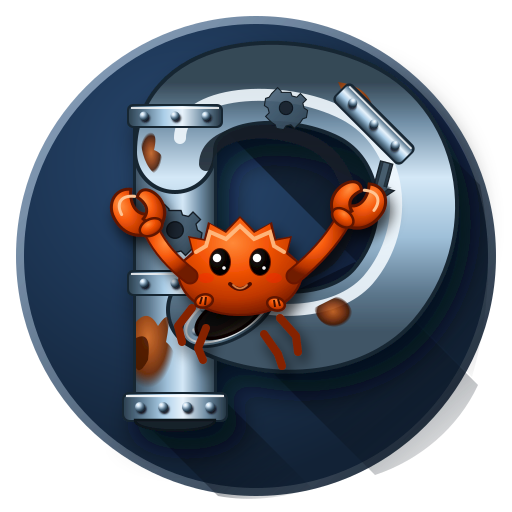
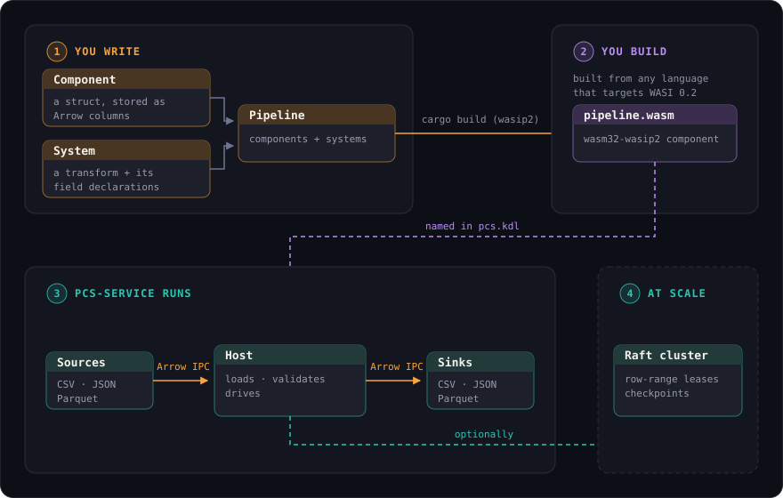

<div align="center">
  

  <h1>PCS</h1>

  <p><strong>Batch pipelines as WebAssembly components. Write them in any language.</strong></p>

[](https://nassor.github.io/pcs/)
[](https://github.com/nassor/pcs/actions/workflows/ci.yml)
[](LICENSE)
[](https://www.rust-lang.org)
[](#project-status)

</div>

## What it is

PCS (Pipeline Component System) is a columnar batch processing engine built on Apache Arrow.

You write transforms as plain structs. Each one declares **which Arrow fields it reads and which it
writes**. That declaration is the only scheduling input PCS needs. It builds a dependency graph from
the field overlaps, groups work that cannot conflict into stages it can run concurrently, retries
what fails, and optionally spreads the work across a cluster.

You never write a stage list.

The engine and the host are Rust. The *pipeline* contract is the `pcs:pipeline@0.2.0` WIT world, so
any language that compiles to a WASI 0.2 component can implement it. The Rust guest SDK is a
convenience, not a requirement. See
[WebAssembly guests](https://nassor.github.io/pcs/guests/).

## What it is for

Reach for PCS when:

- Work arrives as **batches of 100k to 100M rows**, or as a **stream of individual items** you want
  processed one at a time.
- The transform is **imperative code** that SQL expresses awkwardly.
- Schemas are **wide**, tens to hundreds of columns, of which each step touches a few.
- **Recovery time** is a design constraint, not an afterthought.

Look elsewhere when you want SQL (use [DataFusion](https://datafusion.apache.org/)), or you have
fewer than ~10k rows total and a `Vec` would do. For per-item processing, run the same pipeline in
[stream mode](https://nassor.github.io/pcs/service/): sub-millisecond per item in-process. Batch mode
remains the default for throughput.

The name is a nod to ECS (Entity Component System) from game development. Where ECS organises game
entities as components that systems act on each frame, PCS organises a data `Pipeline` as
`Component`s that `System`s transform in field-granular DAG order.

## End to end

PCS is service-first. You do not deploy a binary containing your pipeline. You deploy `pcs-service`
once and hand it WebAssembly components.

<p align="center">
  
</p>

The guest component owns the DAG, the stage plan, and retry. The host owns IO, checkpointing,
distribution, and the HTTP control plane. Data crosses the boundary as **Arrow IPC bytes and nothing
else**, so your pipeline never opens a socket or a file.

## Why columns

Storing each field as a contiguous Arrow column, rather than a row per record, changes what the
machine has to move:

- A system reading 3 of 50 columns loads **24 MB instead of 400 MB** per million rows.
- Handing a batch to the next stage is an `Arc` clone: one atomic increment, no copy.
- Checkpointing is a contiguous buffer write, so recovery decodes **6x faster** than a row-oriented
  equivalent at 1M rows.

Numbers and methodology: [benchmark results](https://nassor.github.io/pcs/benchmarks/).

## Quick start

```bash
rustup target add wasm32-wasip2
cargo install cargo-component --locked --version 0.21.1
cargo install wasm-tools    --locked --version 1.246.2
```

Run a working pipeline without writing anything:

```bash
cargo run -p pcs-service --example scheduler_etl
```

Then compile that same style of pipeline to a WebAssembly component and confirm it exports the PCS
world:

```bash
cargo component build --release -p order-processing-wasm --target wasm32-wasip2

wasm-tools validate --features component-model \
    target/wasm32-wasip1/release/order_processing_wasm.wasm
```

The `wasip1` output directory is expected for a `wasm32-wasip2` build: `cargo-component` compiles
the core module for `wasip1` and then adapts it into a WASI 0.2 component.

For your own component, your own system, and the config that runs it, follow
**[Build your first pipeline](https://nassor.github.io/pcs/native/tutorial/)**.

## Six languages, one pipeline

`examples/polyglot/` implements a single `Order` workload as six separate WebAssembly components,
chained by a Rust driver through the same host `pcs-service` uses. Every stage exports the same WIT
world; nothing but the language differs.

| # | stage | language | toolchain | writes |
|---|-------|----------|-----------|--------|
| 1 | `validate-go` | Go | `componentize-go` | `valid` |
| 2 | `enrich-py` | Python | `componentize-py` | `usd_amount` |
| 3 | `score-ts` | TypeScript | `jco` | `risk_score`, `flagged` |
| 4 | `fee-kt` | Kotlin | Gradle plus `wit-bindgen` and `wasm-tools` | `fee` |
| 5 | `tier-cs` | C# | `componentize-dotnet` | `review_tier` |
| 6 | `settle-rs` | Rust | `cargo-component` | `settlement` plus a cross-batch ledger |

```bash
bash scripts/build-polyglot.sh
cargo run -p pcs-service --features wasm,tracing --example polyglot_orders
```

Details, the byte-level contract, and a per-language recipe:
[six languages, one pipeline](https://nassor.github.io/pcs/guests/six-languages/).

## Documentation

| | |
|---|---|
| **[Build your first pipeline](https://nassor.github.io/pcs/native/tutorial/)** | A native pipeline in nine steps, from the component to the stage plan |
| **[Dataset & Components](https://nassor.github.io/pcs/dataset/)** | How data is stored, appended, deleted, and serialised |
| **[Systems](https://nassor.github.io/pcs/systems/)** | Writing a transform and declaring its field access |
| **[Pipeline](https://nassor.github.io/pcs/pipeline/)** | Stage derivation and per-system retry |
| **[Scheduler](https://nassor.github.io/pcs/scheduler/)** | Several pipelines in one process, with dependencies |
| **[Sources & Sinks](https://nassor.github.io/pcs/io/)** | Getting rows in and out |
| **[Distributed Runner](https://nassor.github.io/pcs/distributed/)** | Row-range leases, checkpoints, Raft |
| **[Service](https://nassor.github.io/pcs/service/)** | TOML schema, validation gates, HTTP control plane |
| **[Operating pcs-service](https://nassor.github.io/pcs/operations/running-pcs/)** | Deployment, tuning, failure modes |
| **[Tracing](https://nassor.github.io/pcs/tracing/)** | Spans, metrics, and the Prometheus endpoint |
| **[WebAssembly guests](https://nassor.github.io/pcs/guests/)** | The WIT contract and a recipe per language |
| **[Six languages, one pipeline](https://nassor.github.io/pcs/guests/six-languages/)** | The polyglot example: one Order workload, six components |
| **[The Arrow codec packages](https://nassor.github.io/pcs/reference/arrow-ipc-packages/)** | `pcs-arrow-ipc` for Go, Python, TypeScript, Kotlin and C# |

Also in this repo: [WASM guest examples](./examples/wasm/), the [polyglot
example](./examples/polyglot/), [Rust-native examples](./crates/pcs-service/examples/), the
Apache-2.0 [Arrow codec packages](./packages/), and toolchain pins for [Rust
guests](./crates/pcs-guest/PINS.md) and [the other
languages](./examples/polyglot/PINS.md).

## Workspace

| Crate | Contents |
|---|---|
| `pcs-core` | `Dataset`, `Component`, `System`, `Pipeline`, `Scheduler`. Arrow-only dependencies; used by both host and guest. |
| `pcs-guest` | Guest SDK. Re-exports `pcs-core`, provides `export_pipeline!`, owns the canonical WIT at `wit/pipeline.wit`. |
| `pcs-service` | Host binary: wasmtime, IO, distribution, config, HTTP. |
| `pcs-guest-smoketest` | Minimal guest component used by CI to gate the Arrow IPC wire format. |
| `pcs-polyglot-order` | The canonical `Order` schema every stage of the polyglot example shares. |
| `polyglot-settle-wasm` | Rust stage of the polyglot example: writes `settlement`, keeps the ledger. |

## Building from source

```bash
cargo build --features service,wasm          # standalone binary
cargo build --features service-cluster,wasm  # with Raft cluster support
cargo test --workspace --all-features     # full suite
cargo clippy --all-targets --all-features -- -D warnings
```

## Project status

This is a playground project exploring two things:

1. **How far specialised AI coding agents can maintain a non-trivial Rust codebase**, spanning
   multiple crates, a binary, and a WebAssembly component, with minimal human intervention in
   maintenance and review.
2. **The design space of a Rust-native batch engine with WebAssembly extensibility.**

It is **not production-ready** and the crates are not published to crates.io. Contributions and
feedback are very welcome.

## License

Licensed under the GNU Affero General Public License v3.0. See [LICENSE](LICENSE).
