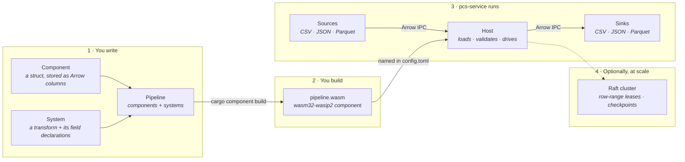

<div align="center">
  

  <h1>PCS</h1>

  <p><strong>Batch pipelines in Rust that work out their own execution order.</strong></p>

[](https://nassor.github.io/pcs/)
[](https://github.com/nassor/pcs/actions/workflows/ci.yml)
[](LICENSE)
[](https://www.rust-lang.org)
[](#project-status)

</div>

## What it is

PCS (Pipeline Component System) is a columnar batch processing engine for Rust, built on
Apache Arrow.

You write transforms as plain Rust structs. Each one declares **which Arrow fields it reads
and which it writes**. That declaration is the only scheduling input PCS needs: it builds a
dependency graph from the field overlaps, groups work that cannot conflict into stages it is
free to run concurrently, retries what fails, and — optionally — spreads the work across a cluster.

You never write a stage list.

## What it is for

Reach for PCS when:

- Batches are **100k–100M rows** and latency is measured in seconds, not microseconds.
- The transform is **imperative Rust** that SQL expresses awkwardly.
- Schemas are **wide** — tens to hundreds of columns, of which each step touches a few.
- **Recovery time** is a design constraint, not an afterthought.

Look elsewhere when you want SQL (use [DataFusion](https://datafusion.apache.org/)),
sub-millisecond streaming, or you have fewer than ~10k rows and a `Vec` would do.

The name is a nod to ECS (Entity Component System) from game development. Where ECS
organises game entities as components that systems act on each frame, PCS organises a data
`Pipeline` as `Component`s that `System`s transform in field-granular DAG order.

## End to end

PCS is service-first. You do not deploy a binary containing your pipeline — you deploy
`pcs-service` once and hand it WebAssembly components.


```mermaid
flowchart LR
    subgraph AUTHOR["1 · You write"]
        direction TB
        C["Component<br/><i>a struct, stored as Arrow columns</i>"]
        S["System<br/><i>a transform + its field declarations</i>"]
        P["Pipeline<br/><i>components + systems</i>"]
        C --> P
        S --> P
    end

    subgraph BUILD["2 · You build"]
        direction TB
        W["pipeline.wasm<br/><i>wasm32-wasip2 component</i>"]
    end

    subgraph RUN["3 · pcs-service runs"]
        direction TB
        SRC["Sources<br/><i>CSV · JSON · Parquet</i>"]
        HOST["Host<br/><i>loads · validates · drives</i>"]
        SNK["Sinks<br/><i>CSV · JSON · Parquet</i>"]
        SRC -- "Arrow IPC" --> HOST
        HOST -- "Arrow IPC" --> SNK
    end

    subgraph SCALE["4 · Optionally, at scale"]
        direction TB
        R["Raft cluster<br/><i>row-range leases · checkpoints</i>"]
    end

    P -- "cargo component build" --> W
    W -- "named in config.toml" --> HOST
    HOST -.-> R
```

The guest component owns the DAG, the stage plan, and retry. The host owns IO,
checkpointing, distribution, and the HTTP control plane. Data crosses the boundary as
**Arrow IPC bytes and nothing else** — your pipeline never opens a socket or a file.

## Why columns

Storing each field as a contiguous Arrow column, rather than a row per record, changes what
the machine has to move:

- A system reading 3 of 50 columns loads **24 MB instead of 400 MB** per million rows.
- Handing a batch to the next stage is an `Arc` clone — one atomic increment, no copy.
- Checkpointing is a contiguous buffer write, so recovery decodes **19× faster** than a
  row-oriented equivalent at 1M rows.

Numbers and methodology: [benchmark results](./docs/content/benchmarks/phase7-results.md).

## Quick start

```bash
rustup target add wasm32-wasip2
cargo install cargo-component --locked --version 0.21.1
cargo install wasm-tools    --locked --version 1.246.2
```

Run a working pipeline without writing anything:

```bash
cargo run -p pcs-service --example scheduler_etl
```

Then compile that same style of pipeline to a WebAssembly component and confirm it exports
the PCS world:

```bash
cargo component build --release -p order-processing-wasm --target wasm32-wasip2

wasm-tools validate --features component-model \
    target/wasm32-wasip1/release/order_processing_wasm.wasm
```

The `wasip1` output directory is expected for a `wasm32-wasip2` build: `cargo-component`
compiles the core module for `wasip1` and then adapts it into a WASI 0.2 component.

The full walkthrough — your own component, your own system, and the config that runs it —
is the **[Build your first pipeline](https://nassor.github.io/pcs/getting-started/)** guide.

## Documentation

| | |
|---|---|
| **[Build your first pipeline](https://nassor.github.io/pcs/getting-started/)** | Five minutes, from `cargo new` to a running service |
| **[Dataset & Components](https://nassor.github.io/pcs/dataset/)** | How data is stored, appended, deleted, and serialised |
| **[Systems](https://nassor.github.io/pcs/systems/)** | Writing a transform and declaring its field access |
| **[Pipeline](https://nassor.github.io/pcs/pipeline/)** | Stage derivation and per-system retry |
| **[Scheduler](https://nassor.github.io/pcs/scheduler/)** | Several pipelines in one process, with dependencies |
| **[Sources & Sinks](https://nassor.github.io/pcs/io/)** | Getting rows in and out |
| **[Distributed Runner](https://nassor.github.io/pcs/distributed/)** | Row-range leases, checkpoints, Raft |
| **[Service](https://nassor.github.io/pcs/service/)** | TOML schema, validation gates, HTTP control plane |
| **[Operating pcs-service](https://nassor.github.io/pcs/operations/running-pcs/)** | Deployment, tuning, failure modes |
| **[Tracing](https://nassor.github.io/pcs/tracing/)** | Spans, metrics, and the Prometheus endpoint |

Also in this repo: [WASM guest examples](./examples/wasm/), [Rust-native
examples](./crates/pcs-service/examples/), and [toolchain
pins](./crates/pcs-guest/PINS.md) for guest development.

## Workspace

| Crate | Contents |
|---|---|
| `pcs-core` | `Dataset`, `Component`, `System`, `Pipeline`, `Scheduler`. Arrow-only dependencies; used by both host and guest. |
| `pcs-guest` | Guest SDK. Re-exports `pcs-core`, provides `export_pipeline!`, owns the canonical WIT at `wit/pipeline.wit`. |
| `pcs-service` | Host binary: wasmtime, IO, distribution, config, HTTP. |
| `pcs-guest-smoketest` | Minimal guest component used by CI to gate the Arrow IPC wire format. |

## Building from source

```bash
cargo build --features service,wasm          # standalone binary
cargo build --features service-cluster,wasm  # with Raft cluster support
cargo test --workspace --all-features     # full suite
cargo clippy --all-targets --all-features -- -D warnings
```

## Project status

This is a playground project exploring two things:

1. **How far specialised Claude Code agents can maintain a non-trivial Rust codebase** —
   multiple crates, a binary, and a WebAssembly component — with minimal human intervention
   in maintenance and review.
2. **The design space of a Rust-native batch engine with WebAssembly extensibility.**

It is **not production-ready** and the crates are not published to crates.io. Contributions
and feedback are very welcome.

## License

Licensed under the GNU Affero General Public License v3.0 — see [LICENSE](LICENSE).
