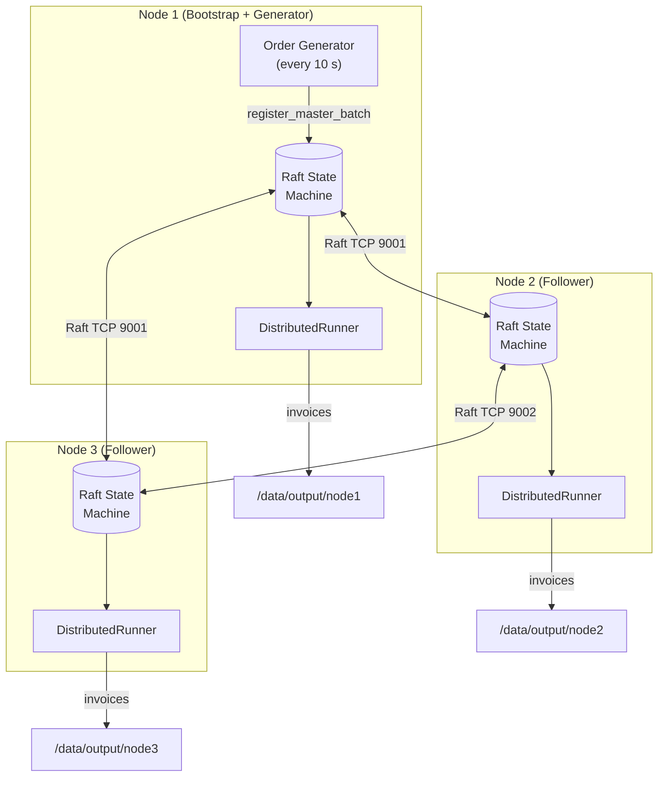
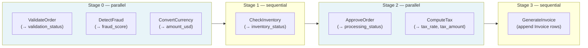
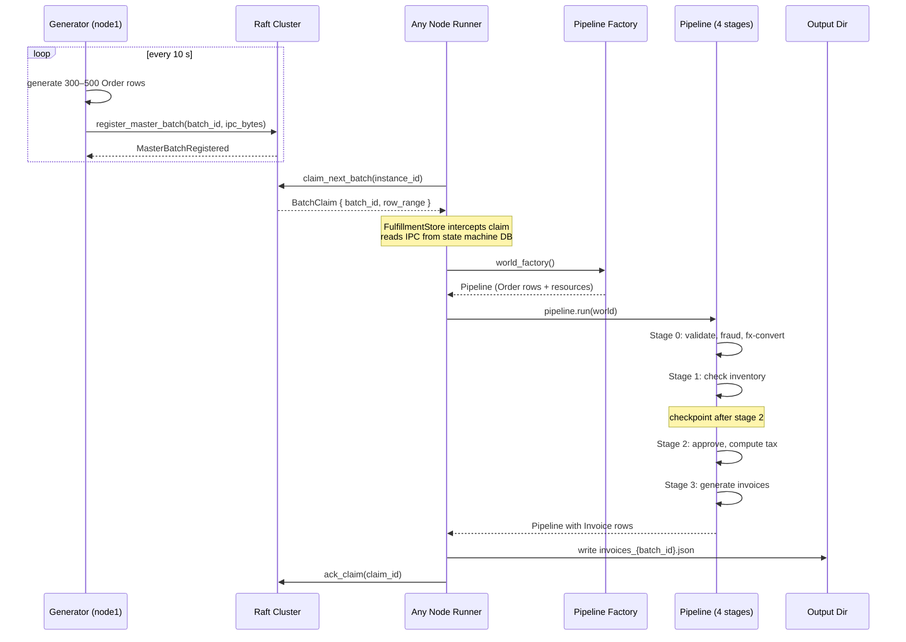
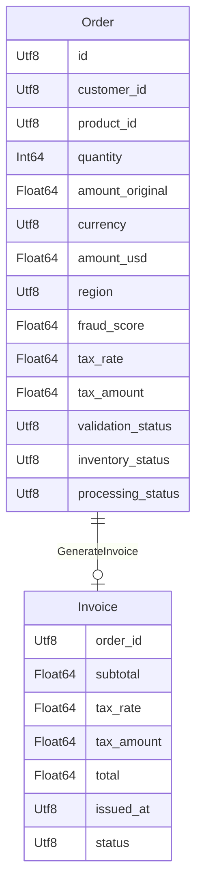

# Distributed Order Fulfillment

A self-contained example demonstrating most of PCS's distributed processing
features: field-granular DAG scheduling, parallel and sequential systems,
world resources, checkpointing, Raft consensus, and structured tracing across
three nodes.

---

## Architecture

### 1 — Cluster Topology



- **Node 1** bootstraps the Raft cluster and runs an embedded generator task.
- All 3 nodes run a `DistributedRunner` that claims, processes, checkpoints, and
  acks batches via Raft-replicated state.
- The generator only writes when node 1 is the leader; followers skip silently.

---

### 2 — Pipeline DAG (4 Stages)



Systems in Stage 0 and Stage 2 write **disjoint fields** — PCS's
field-level conflict analyser schedules them in the same stage and runs them
concurrently (`ParallelSystem`). Stage 1 and Stage 3 systems need exclusive
world access (`System` with `&mut Pipeline`).

---

### 3 — Data Flow



---

### 4 — Component Schema



---

## Running Locally

### Prerequisites

- Rust 1.95+
- 3 terminals

### Build

```bash
cargo build --example distributed_fulfillment --features service-cluster
```

### Terminal 1 — Bootstrap node + generator

```bash
RUST_LOG=trace ./target/debug/examples/distributed_fulfillment \
  --node-id 1 --bootstrap \
  --listen 127.0.0.1:9001 \
  --data-dir /tmp/fulfillment/node1 \
  --output-dir /tmp/fulfillment/output/node1 \
  --peers 127.0.0.1:9002,127.0.0.1:9003 \
  --generator-interval 10
```

### Terminal 2

```bash
RUST_LOG=trace ./target/debug/examples/distributed_fulfillment \
  --node-id 2 \
  --listen 127.0.0.1:9002 \
  --data-dir /tmp/fulfillment/node2 \
  --output-dir /tmp/fulfillment/output/node2 \
  --peers 127.0.0.1:9001,127.0.0.1:9003
```

### Terminal 3

```bash
RUST_LOG=trace ./target/debug/examples/distributed_fulfillment \
  --node-id 3 \
  --listen 127.0.0.1:9003 \
  --data-dir /tmp/fulfillment/node3 \
  --output-dir /tmp/fulfillment/output/node3 \
  --peers 127.0.0.1:9001,127.0.0.1:9002
```

---

## Running with Docker Compose

```bash
# Build + start all 3 nodes
docker compose -f examples/distributed_fulfillment/docker-compose.yml up --build

# Watch logs in real-time
docker compose -f examples/distributed_fulfillment/docker-compose.yml \
  logs -f --tail=50 node1 node2 node3

# Stop
docker compose -f examples/distributed_fulfillment/docker-compose.yml down
```

---

## Observable Behaviour

| What you see | What it means |
|---|---|
| `generator: registered batch N (M rows)` | Node 1 is leader, new work available |
| `generator: skipping batch (not leader …)` | Node 1 lost leadership; another node is leading |
| `claimed batch N` | A node won the race for this batch |
| `stage 0–3 logs` | Pipeline executing on the claiming node |
| `acked batch N` | Batch fully processed; won't be retried |
| `checkpoint at stage 2` | Intermediate state saved; safe to resume after crash |

---

## Feature Highlights

| Feature | Where |
|---|---|
| Field-granular DAG scheduling | `systems.rs` → `build_pipeline()` |
| `ParallelSystem` (concurrent stage) | `ValidateOrderSystem`, `DetectFraudSystem`, `ConvertCurrencySystem`, `ApproveOrderSystem`, `ComputeTaxSystem` |
| `System` (sequential, `&mut Pipeline`) | `CheckInventorySystem`, `GenerateInvoiceSystem` |
| Pipeline resources (non-columnar) | `resources.rs` → `FxRateTable`, `TaxRateTable`, `InventoryCatalog`, `NodeId` |
| Retry config | `GenerateInvoiceSystem::config()` → `RetryMode::Fixed { retries: 3 }` |
| `world.append::<Invoice>()` | `GenerateInvoiceSystem::run()` — Invoice rows created at runtime |
| Raft consensus | `ArrowRaftDriver` via `distributed-raft` feature |
| Checkpoint every N stages | `CheckpointStrategy::EveryNStages(2)` in `RunnerConfig` |
| At-least-once semantics | `DistributedRunner` claim → ack cycle |
| Structured tracing | Every system emits `tracing::info!` with `node_id`, `batch_id`, `stage` |
